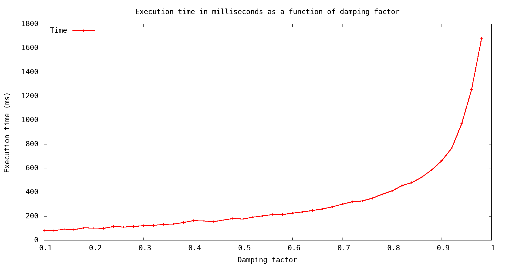

# Page rank

Simple implementation of the page rank algorithm, more specifically the power
method.

There are severals binaries :
- wreivtof, write eigen vector to file
- wrprettof, write page rank execution time to file




## Compilation

```
make
```

## Binaries

### wreivtof

Given a graph, an output file and additionaly a damping factor,
runs the page rank implementation and writes the eigen vector to
the output file.

```
./bin/wreivtof <filepath> <output_file> [damping]
```

Damping factor is 0.85 by default.

Usage :

```
./bin/wreivtof resources/email-Eu-core.txt result.txt 0.9
```

It also prints the sum of all elements of the vector, so it might be usefull to check
if the vector is normalized.

### wrprettof

Given a graph and an output file, runs the page rank
implementation for multiples damping factors and writes
the execution times to the output file.

```
./bin/wrprettof <filepath> <output_file>
```

It runs page rank, with damping 0.1 to 0.9 with a pace of 0.2.

Usage :

```
./bin/wrprettof resources/email-Eu-core.txt time.txt
```

#### ompwrprettof

Runs wrprettof with OpenMP parallelization. Better than wrprettof by a few milliseconds on my laptop.

```
./bin/ompwrprettof <filepath> <output_file>
```

#### Plot of execution time

You can then generate a chart from the execution times.

```
gnuplot -c scripts/chart.gp <output_file> > <png_file>
gnuplot -c scripts/chart.gp time.txt > chart.png
```

# TODO

- Documentation
- Multithreading with OpenMP
